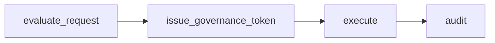
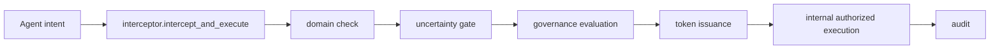

# Cognitive Firewall

Constraint-Engine is **runtime governance infrastructure for agents**.

This repository has shifted from **validator** to **governor**:

- validator: classify/risk score outputs
- governor: define and enforce pre-action execution boundaries

## Governance pipeline

The runtime model is:

1. **permissioning** (state + policy + identity + solvency)
2. **execution** (governed token-bound call path)
3. **correction** (deterministic corrective routing)
4. **audit** (violation and economic traceability)



## Execution architecture



## Runtime state governance

Supported operation modes:

- `RESEARCH`
- `DRAFTING`
- `READ_ONLY`
- `TRANSACTION`
- `PRIVILEGED`
- `HUMAN_REVIEW`
- `QUARANTINED`

Policies can target states and transitions and can deny or permit state movement.

## Constraint hierarchy

Constraint levels:

- `HARD` (immutable)
- `SOFT` (override requires explicit justification)
- `GOAL` (task/session scoped)

Constraint packs (examples):

- `packs/financial_pack.json`
- `packs/privacy_pack.json`
- `packs/brand_pack.json`
- `packs/system_pack.json`

## Intent classes

Intent classes are separated from raw tool names:

- `DATA_ACCESS`
- `DATA_EXPORT`
- `COMMUNICATION`
- `PAYMENT`
- `TRADE`
- `SYSTEM_MODIFICATION`
- `AUTHORIZATION`
- `UNKNOWN`

## Sidecar-friendly API

`governance_service.py` exposes:

- `evaluate_request(...)`
- `issue_governance_token(...)`
- `execute(...)` (intentionally blocked; interceptor is required)

Designed for future FastAPI/gRPC sidecar deployment.

## Boundary API

Public boundary functions in `gate.py`:

```python
configure_authority(...)
register_tool(...)
issue_governance_token(intent, actor_context, tool_name, tool_args)
```

Public execution entry point:

```python
intercept_and_execute(intent, actor_context)
```

Execution path:
`intent -> interceptor -> domain check -> governance evaluation -> token issuance -> internal authorized execution -> tool`.

`gate.execute(...)` is intentionally blocked and always returns `BLOCK` with reason `intercept_and_execute required` to prevent direct execution bypasses.

## What this proves

- denied requests cannot execute.
- execution requires governed token.
- tokens bind intent/tool/payload.
- state survives restart with SQLite store.
- secret access is denied unless explicitly allowed.

## ALLOW / SPECULATE / BLOCK

Cognitive-firewall does not eliminate speculation. It prevents speculation from pretending to be verified knowledge.

- `ALLOW`: confidence and critical assumptions support normal governed execution.
- `SPECULATE`: bounded execution mode; allocation caps are enforced before token issuance and execution proceeds only through interceptor and authorized internal gate execution.
- `BLOCK`: unsupported speculation, contradictory evidence, domain mismatch, or governance denial.

For speculative decisions, unsupported critical assumptions are blocked and requested allocation must remain under confidence-derived caps before governance token issuance.

## Quickstart

```bash
# install dependencies (Python 3.10+ recommended)
python -m venv .venv
source .venv/bin/activate

# run full tests
python -m unittest discover -s tests -v

# run deterministic domain mismatch demo
python demo_domain_mismatch.py

# run speculative mode demo
python demo_speculative_mode.py

# run middleware demo
python middleware_example.py

# run benchmark
python benchmark_firewall_economics.py
```

## Demo outputs (compact)

`python demo_domain_mismatch.py`:

```json
{
  "decision": "BLOCK",
  "reason": "DOMAIN_MISMATCH",
  "epistemic_status": "UNSTABLE",
  "violations": ["gravity"],
  "executed": false
}
```

`python demo_speculative_mode.py`:

```json
{
  "decision": "SPECULATE",
  "speculative": true,
  "confidence_average": 0.64,
  "max_allocation_pct": 2.0,
  "executed": true,
  "falsification_triggers": [
    "AI load growth decelerates below grid expansion",
    "PPA term lengths contract materially",
    "SMR deployment accelerates ahead of baseline"
  ]
}
```
