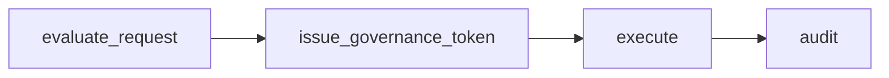

# Cognitive Firewall

Constraint-Engine is **runtime governance infrastructure for agents**.

This repository has shifted from **validator** to **governor**:

- validator: classify/risk score outputs
- governor: define and enforce pre-action execution boundaries

## Governance pipeline

The runtime model is:

1. **permissioning** (state + policy + identity + solvency)
2. **execution** (governed token-bound call path)
3. **correction** (deterministic corrective routing)
4. **audit** (violation and economic traceability)



## Runtime state governance

Supported operation modes:

- `RESEARCH`
- `DRAFTING`
- `READ_ONLY`
- `TRANSACTION`
- `PRIVILEGED`
- `HUMAN_REVIEW`
- `QUARANTINED`

Policies can target states and transitions and can deny or permit state movement.

## Constraint hierarchy

Constraint levels:

- `HARD` (immutable)
- `SOFT` (override requires explicit justification)
- `GOAL` (task/session scoped)

Constraint packs (examples):

- `packs/financial_pack.json`
- `packs/privacy_pack.json`
- `packs/brand_pack.json`
- `packs/system_pack.json`

## Intent classes

Intent classes are separated from raw tool names:

- `DATA_ACCESS`
- `DATA_EXPORT`
- `COMMUNICATION`
- `PAYMENT`
- `TRADE`
- `SYSTEM_MODIFICATION`
- `AUTHORIZATION`
- `UNKNOWN`

## Sidecar-friendly API

`governance_service.py` exposes:

- `evaluate_request(...)`
- `issue_governance_token(...)`
- `execute(...)`

Designed for future FastAPI/gRPC sidecar deployment.

## Boundary API

Public boundary functions in `gate.py`:

```python
configure_authority(...)
register_tool(...)
issue_governance_token(intent, actor_context, tool_name, tool_args)
execute(intent, actor_context, governance_decision, tool_name, tool_args)
```

Execution is blocked unless governance decision is `ALLOW`, token is present, and token context matches intent/tool/payload.

## What this proves

- denied requests cannot execute.
- execution requires governed token.
- tokens bind intent/tool/payload.
- state survives restart with SQLite store.
- secret access is denied unless explicitly allowed.

## Quickstart

```bash
# run full tests
python -m unittest discover -s tests -v

# run middleware demo
python middleware_example.py

# run deterministic domain mismatch demo
python demo_domain_mismatch.py

# run benchmark
python benchmark_firewall_economics.py
```
