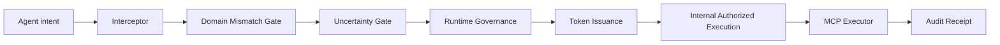

# Cognitive-firewall Runtime Architecture

```mermaid
flowchart LR
  A[Agent intent] --> B[Interceptor]
  B --> C[Domain Mismatch Gate]
  C --> D[Uncertainty Gate]
  D --> E[Runtime Governance]
  E --> F[Token Issuance]
  F --> G[Internal Authorized Execution]
  G --> H[MCP Executor]
  H --> I[Audit Receipt]
```

This architecture is execution governance middleware: it controls consequential tool execution, not generic prompt scanning.
